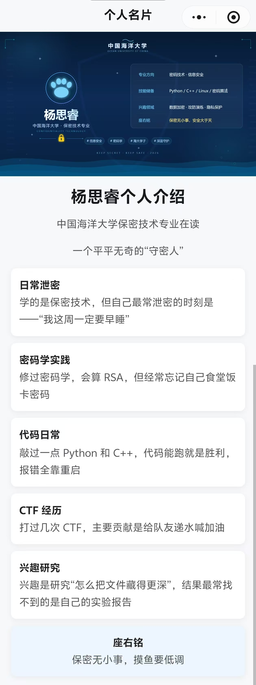

# 移动软件开发实验报告

<center>姓名：杨思睿　        学号：24020007146</center>

| 项目 | 内容 |
| :-: | :-: |
| 姓名和学号 | 杨思睿 24020007146 |
| 本实验属于哪门课程 | 中国海洋大学26夏《移动软件开发》 |
| 实验名称 | 实验1：热身运动 |
| 博客地址 | https://blog.csdn.net/2401_87694000/article/details/164055472?fromshare=blogdetail&sharetype=blogdetail&sharerId=164055472&sharerefer=PC&sharesource=2401_87694000&sharefrom=from_link |
| 代码仓库地址 | https://github.com/[你的用户名]（选做） |

---

## 一、实验内容

本次实验为《移动软件开发》课程的热身实验，目标是熟悉微信小程序开发流程，使用微信开发者工具创建一个简单的个人介绍小程序页面。页面包含：

1. 顶部自定义导航栏，显示标题；
2. 一张个人介绍图片；
3. 个人姓名、学校专业等文字介绍；
4. 若干条个人信息卡片；
5. 页面支持上下滑动，保证内容超出屏幕时可以正常浏览；
6. 页面整体美观、清爽。

---

## 二、实验步骤与关键实现

### 1. 项目初始化

使用微信开发者工具创建小程序项目，得到 `app.json`、`app.js`、`app.wxss` 以及默认的 `pages/index/index` 页面文件。

### 2. 配置自定义导航栏

在 `app.json` 中开启自定义导航栏：

```json
"window": {
  "navigationBarTextStyle": "black",
  "navigationStyle": "custom"
}
```

然后在 `pages/index/index.json` 中注册 `navigation-bar` 组件：

```json
"usingComponents": {
  "navigation-bar": "/components/navigation-bar/navigation-bar"
}
```

在页面中使用组件并设置标题：

```xml
<navigation-bar title="实验二" back="{{false}}"></navigation-bar>
```

### 3. 添加个人介绍图片

页面顶部使用 `<image>` 组件显示图片：

```xml
<image class="intro-image" mode="widthFix" src="../../image/1.jpg"></image>
```


对应的样式让图片宽度铺满屏幕：

```css
.intro-image {
  width: 100%;
  display: block;
}
```

> **注意**：最开始图片文件名为 `我的个人介绍.png`（含中文），编译时微信开发者工具将其 URL 编码后找不到文件，报错 `ENOENT`。解决方法是将图片重命名为英文文件名 `intro.png`，并同步修改引用路径。

### 4. 文字内容排版

将姓名、专业、个人经历等内容用 `view` 和 `text` 组织成卡片列表：

```xml
<view class="card-list">
  <view class="card">
    <text class="card-title">日常泄密：</text>
    <text class="card-text">学的是保密技术，但自己最常泄密的时刻是——“我这周一定要早睡”</text>
  </view>
  ...
</view>
```

### 5. 实现页面滚动

由于内容可能超出屏幕，将图片和文字内容包裹在 `<scroll-view>` 中：

```xml
<scroll-view class="scrollarea" scroll-y>
  <image ...></image>
  <view class="content">...</view>
</scroll-view>
```

页面使用 flex 布局让滚动区域占满导航栏下方空间：

```css
page {
  height: 100vh;
  display: flex;
  flex-direction: column;
}
.scrollarea {
  flex: 1;
  overflow-y: auto;
}
```

### 6. 页面美化

- 使用 `rpx` 作为响应式单位；
- 卡片使用白底、圆角、阴影，营造清爽层次感；
- 标题和卡片小标题使用 `font-weight: bold` 加粗；
- 座右铭卡片使用浅蓝色背景突出显示。


---

## 三、问题总结与体会

### 1. 中文资源文件名导致编译报错

**问题**：图片文件名为 `我的个人介绍.png`，运行时微信开发者工具尝试打开 URL 编码后的路径 `%E6%88%91...`，提示 `ENOENT: no such file or directory`。

**解决**：将图片重命名为英文 `intro.png`，并同步更新 `index.wxml` 中的 `src`。

**体会**：小程序资源文件最好使用英文命名，避免编码兼容问题。

### 2. 图片被拉伸

**问题**：图片显示变形、被拉伸。

**解决**：检查后发现 `image` 组件的 `mode` 值写成了 `WidthFix`（大写 W），正确值应为 `widthFix`。同时给图片设置 `width: 100%`，让高度按比例自动缩放。

**体会**：组件属性值要严格区分大小写，遇到显示异常首先检查属性拼写和取值。

### 3. 页面无法滑动

**问题**：内容较多时，页面底部内容被截断，无法滑动查看。

**解决**：使用 `<scroll-view scroll-y>` 包裹图片和内容区，并让滚动区域占满剩余屏幕高度。

### 4. 黑屏

**问题**：加入 `scroll-view` 后页面黑屏。

**解决**：检查 `index.wxml` 结构，发现 `<view class="content">` 缺少对应的 `</view>` 结束标签，导致 WXML 结构解析异常。补全标签后恢复正常。

**体会**：小程序对标签配对要求严格，出现黑屏/白屏时优先检查标签是否正确闭合。

---

## 四、收获与建议

通过本次实验，我熟悉了微信小程序的基本文件结构（`app.json`、页面四件套、自定义组件），掌握了 `image`、`scroll-view`、`view`、`text` 等基础组件的使用，也学会了用 `rpx`、flex 布局和卡片样式进行简单的美化。

建议课程中可以多补充一些常见报错案例（如中文文件名、标签未闭合、属性大小写等），帮助初学者更快定位问题。
