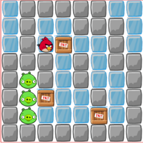
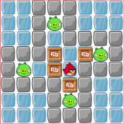
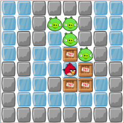
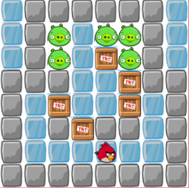

# 实验四：微信小程序推箱子游戏

<center>姓名：杨思睿</center><center>学号：24020007146</center>

| 项目 | 内容 |
| :-: | :-: |
| 姓名和学号 | 杨思睿 24020007146 |
| 本实验属于哪门课程 | 中国海洋大学26夏《移动软件开发》 |
| 实验名称 | 实验四：微信小程序推箱子游戏 |
| 博客地址 | https://blog.csdn.net/2401_87694000/article/details/164256144?fromshare=blogdetail&sharetype=blogdetail&sharerId=164256144&sharerefer=PC&sharesource=2401_87694000&sharefrom=from_link |
| 代码仓库地址 | https://github.com/CarterYangCoder/Mini-Program-Development-Course-Experiment.git |

---

## 一、实验内容

本实验使用原生微信小程序框架实现一款推箱子益智游戏。游戏以 8×8 二维数组描述地图，通过 Canvas 2D 绘制冰面、石墙、目标、小鸟和 TNT 箱子，并实现方向键控制、棋盘滑动、碰撞判断、推箱移动、撤销、重新开始、关卡切换和通关判定等完整玩法。

在基础游戏功能之外，项目增加了启动加载页和本地玩家档案。玩家需要先选择头像、填写昵称并登录，之后才能进入选关页和游戏页。每位玩家的关卡最佳步数和通关历史独立保存在本地缓存中；退出登录后，选关、游戏和历史页面均不可访问，从而形成“登录—选关—游戏—记录—退出”的完整使用流程。

实现的主要功能如下：

1. 启动页模拟资源加载进度，加载完成后显示玩家登录卡片；
2. 支持通过 `chooseAvatar` 选择头像，并通过昵称输入框创建本地玩家身份；
3. 选关页展示四个关卡、玩家头像昵称、已通关数量、总对局数和各关最佳步数；
4. 使用 Canvas 2D 高清绘制 8×8 游戏地图，并预加载本地游戏素材；
5. 支持方向键点击和棋盘滑动两种操作方式；
6. 实现边界、墙体、箱子和箱子后方位置的完整移动合法性判断；
7. 支持移动动画、推箱动画、轻重震动反馈、撤销一步和重新开始；
8. 实时统计步数、目标箱总数和已归位箱数，并显示任务进度；
9. 通关后自动保存个人最佳成绩和最近一百条游戏历史；
10. 游戏历史页展示对局关卡、步数、时间和是否刷新最佳，并支持再次挑战；
11. 未登录时禁止直接进入选关、游戏和历史页面，退出登录后隐藏当前玩家记录；
12. 使用渐变、卡片、阴影、动画和响应式尺寸优化整体游戏界面。

---

## 二、实验步骤与关键实现

### 1. 项目初始化与页面配置

使用微信开发者工具创建原生小程序项目，按功能划分 `start`、`index`、`game` 和 `history` 四个页面。其中启动页负责加载与登录，选关页负责展示玩家状态和关卡入口，游戏页负责核心玩法，历史页负责呈现玩家通关记录。

在 `app.json` 中注册页面并统一设置导航栏和背景色：

```json
{
  "pages": [
    "pages/start/start",
    "pages/index/index",
    "pages/game/game",
    "pages/history/history"
  ],
  "window": {
    "navigationBarBackgroundColor": "#4A6CF7",
    "navigationBarTitleText": "推箱子游戏",
    "navigationBarTextStyle": "white",
    "backgroundColor": "#F3F5F9"
  },
  "style": "v2",
  "lazyCodeLoading": "requiredComponents"
}
```

启动页使用自定义导航样式和全屏渐变背景，游戏页根据当前关卡动态修改导航栏标题。页面跳转分别使用 `redirectTo`、`navigateTo`、`navigateBack` 和 `reLaunch`，以适应进入游戏、打开子页面、返回选关和退出登录等不同场景。

### 2. 使用二维数组设计关卡地图

四个关卡统一保存在 `utils/data.js` 中，每个关卡都是一个 8×8 二维数组。不同数字代表不同游戏元素：`0` 为地图外围，`1` 为石墙，`2` 为道路，`3` 为目标点，`4` 为箱子，`5` 为玩家。

```js
var map1 = [
  [0, 1, 1, 1, 1, 1, 0, 0],
  [0, 1, 2, 2, 1, 1, 1, 0],
  [0, 1, 5, 4, 2, 2, 1, 0],
  [1, 1, 1, 2, 1, 2, 1, 1],
  [1, 3, 1, 2, 1, 2, 2, 1],
  [1, 3, 4, 2, 2, 1, 2, 1],
  [1, 3, 2, 2, 2, 4, 2, 1],
  [1, 1, 1, 1, 1, 1, 1, 1]
]
```

初始化关卡时，将静态地形与动态箱子拆分为 `map` 和 `box` 两个二维数组。这样箱子移动时只需要修改动态层，不会破坏箱子下面的道路或目标点。读取到玩家编号 `5` 时记录初始行列，并将对应地形还原为道路。

```js
if (mapData[i][j] === 4) {
  box[i][j] = 4
  map[i][j] = 2
} else if (mapData[i][j] === 5) {
  map[i][j] = 2
  this.row = i
  this.col = j
}
```

这种“静态地图层 + 动态对象层”的设计便于进行碰撞检测、撤销恢复和目标点判断，也避免了使用单个数组时频繁推断箱子原位置的问题。

### 3. 初始化 Canvas 并高清绘制地图

游戏页面使用新版 Canvas 2D 接口。页面初次渲染后，通过选择器获得 Canvas 节点及实际尺寸，再结合设备像素比设置内部像素宽高，从而避免高分辨率手机上出现画面模糊。

```js
var canvas = res[0].node
var ctx = canvas.getContext('2d')
var dpr = that.getDpr()
var size = res[0].width
canvas.width = size * dpr
canvas.height = size * dpr
ctx.scale(dpr, dpr)

that.canvas = canvas
that.ctx = ctx
that.cell = size / MAP_SIZE
```

Canvas 尺寸根据窗口宽度动态计算，最大为 340 像素、最小为 240 像素，并给页面卡片保留安全边距。绘制前使用 `canvas.createImage()` 预加载冰面、石墙、小猪、箱子和小鸟五种本地图片，所有图片加载结束后再初始化关卡并绘制。

绘制时使用双重循环遍历地图：先绘制冰面、石墙或目标点，再叠加箱子，最后绘制玩家。箱子到达目标后额外绘制半透明绿色圆角高亮，帮助玩家快速识别任务进度。

### 4. 实现移动与推箱碰撞判断

四个方向统一映射为行列增量，方向键和滑动手势最终都调用同一个 `move` 方法，避免出现两套移动规则。

```js
var d = {
  up: [-1, 0],
  down: [1, 0],
  left: [0, -1],
  right: [0, 1]
}[dir]
```

移动时首先判断玩家下一格是否超出地图。若下一格是墙，则直接结束；若下一格是箱子，则继续检查箱子后一格是否在地图内，以及该位置是否为墙或另一个箱子。只有全部条件满足时，才允许同时移动玩家和箱子。

```js
if (box[nr][nc] === 4) {
  var br = nr + d[0]
  var bc = nc + d[1]
  if (br < 0 || br >= MAP_SIZE || bc < 0 || bc >= MAP_SIZE) return
  if (map[br][bc] === 1 || box[br][bc] === 4) return
  pushed = { fromR: nr, fromC: nc, toR: br, toC: bc }
} else if (map[nr][nc] === 1) {
  return
}
```

合法移动完成后更新箱子数组、玩家坐标和步数，并重新统计已归位箱子数量。普通走路触发轻震动，推动箱子触发中等震动，让不同操作具有更明确的触觉反馈。

### 5. 增加平滑移动动画

如果每次操作后直接修改画布，角色会在格子之间瞬间跳动。为提升游戏体验，项目使用 `requestAnimationFrame` 实现约 130 毫秒的移动动画，并通过二次缓出函数计算中间位置：

```js
var t = (Date.now() - a.t0) / a.dur
var e = 1 - (1 - t) * (1 - t)
that.rp = {
  r: a.fromR + (a.pr - a.fromR) * e,
  c: a.fromC + (a.pc - a.fromC) * e
}
```

玩家的逻辑位置仍使用整数行列，而 `rp` 保存动画过程中的浮点渲染位置；推动箱子时使用 `rb` 保存箱子中间位置。动画结束后再清除临时状态。项目还通过动画代数 `animGen` 终止已经被新操作替代的旧循环，避免连续快速操作时多个动画同时重绘。

### 6. 支持方向键、滑动和撤销操作

游戏页提供上、下、左、右四个方向按钮，同时在 Canvas 上监听触摸开始和结束事件。滑动结束后计算横纵位移，先判断是否超过 24 像素阈值，再选择位移更大的方向调用统一移动方法。

```js
var dx = t.clientX - this.touchX
var dy = t.clientY - this.touchY
if (Math.max(Math.abs(dx), Math.abs(dy)) < 24) return
if (Math.abs(dx) > Math.abs(dy)) {
  this.move(dx > 0 ? 'right' : 'left')
} else {
  this.move(dy > 0 ? 'down' : 'up')
}
```

每次合法移动前，将玩家坐标、箱子二维数组和当前步数保存到 `history` 栈中。箱子数组使用逐行复制形成快照，防止后续移动修改历史数据。点击撤销时弹出最后一个快照并恢复游戏状态，历史最多保留 300 步。

### 7. 完成通关判断与关卡切换

每次移动后遍历箱子数组，如果存在没有位于目标点上的箱子，则游戏尚未完成；当全部箱子都位于目标点时触发通关逻辑。

```js
isWin: function () {
  for (var i = 0; i < MAP_SIZE; i++) {
    for (var j = 0; j < MAP_SIZE; j++) {
      if (this.box[i][j] === 4 && this.map[i][j] !== 3) {
        return false
      }
    }
  }
  return true
}
```

通关后先更新最佳步数并写入对局历史，等待移动动画结束后再弹出提示。玩家可以选择挑战下一关、返回选关或重新挑战当前关卡。`winPending` 用于防止通关弹窗出现前继续移动或重复保存记录。

### 8. 实现登录与玩家数据隔离

启动页加载完成后显示玩家身份卡片。头像通过 `open-type="chooseAvatar"` 选择，昵称输入框使用 `type="nickname"`，登录时将头像、昵称和由昵称生成的本地玩家编号保存到缓存。

`utils/auth.js` 集中负责登录状态、最佳成绩和历史记录的读写。成绩与历史的缓存键均包含玩家编号，不同玩家即使使用同一台设备也不会看到彼此的记录。

```js
function userKey(prefix, user) {
  return prefix + '_' + (user && user.id ? user.id : 'guest')
}

function setBest(level, steps, user) {
  if (!user) return false
  var key = userKey('boxgame_best_' + level, user)
  var oldBest = wx.getStorageSync(key) || 0
  if (!oldBest || steps < oldBest) {
    wx.setStorageSync(key, steps)
    return true
  }
  return false
}
```

选关页、游戏页和历史页在加载或显示时都会检查当前用户。若没有登录信息，则通过 `wx.reLaunch` 返回启动页。退出登录只移除当前会话身份，不删除对应成绩；使用相同昵称重新登录后仍可读取该玩家在本机保存的记录。

### 9. 保存和展示游戏历史

每次通关都会生成一条记录，包含时间戳、关卡编号、步数、是否刷新最佳以及格式化后的完成时间。最新记录插入数组首部，最多保留一百条，防止本地缓存无限增长。

```js
auth.addHistory(this.user, {
  id: Date.now(),
  level: this.levelIndex + 1,
  steps: this.steps,
  isNewBest: isNewBest,
  time: this.formatTime(new Date())
})
```

历史页在 `onShow` 中重新读取记录，并计算完成对局数、刷新最佳次数和累计步数。列表使用 `wx:for` 渲染；没有记录时显示空状态，点击“再来”可以直接进入对应关卡。

### 10. 页面美化与移动端适配

启动页采用蓝紫渐变背景、漂浮角色、星光和加载动画；选关页使用玩家状态栏、数据概览和双列关卡卡片；游戏页加入玩家在线状态、当前关卡、步数、最佳成绩、任务进度条和控制面板；历史页使用玩家档案卡片和对局时间线式列表。

项目主要使用 `rpx`、flex 布局和相对尺寸进行适配。Canvas 单独根据设备窗口宽度计算像素尺寸，并结合 DPR 高清绘制。头像选择按钮设置固定宽高和禁止伸缩，昵称输入框设置 `flex: 1 1 0` 与 `min-width: 0`，避免微信原生按钮默认样式挤压输入区域。装饰图标使用绝对定位并为文字区域预留安全距离，防止图标覆盖标题或统计信息。

四个关卡的预览效果如下：

<p align="center">
  
  
  
  
</p>

---

## 三、运行与测试结果

使用微信开发者工具导入 `狼崽004` 项目目录，确认 AppID 和基础库配置后点击“编译”即可运行。测试时从未登录状态开始，依次验证登录、选关、游戏操作、撤销、通关、历史记录和退出登录等场景。

| 测试项 | 预期结果 | 测试结果 |
| :- | :- | :- |
| 启动加载 | 进度条能够增长到 100%，加载完成后显示登录区域 | 通过 |
| 头像昵称 | 可选择头像、输入昵称并成功创建玩家身份 | 通过 |
| 登录拦截 | 未登录时不能直接进入选关、游戏或历史页面 | 通过 |
| 关卡选择 | 四个关卡正常显示，可进入指定关卡 | 通过 |
| Canvas 绘制 | 地图、墙体、目标、箱子和玩家显示清晰且位置正确 | 通过 |
| 方向键移动 | 四个方向按钮均能控制玩家，非法移动不会增加步数 | 通过 |
| 滑动控制 | 在棋盘上向四个方向滑动能够触发对应移动 | 通过 |
| 推箱规则 | 箱子后方为墙、边界或另一个箱子时不能推动 | 通过 |
| 动画与反馈 | 玩家和箱子移动平滑，不同操作具有震动反馈 | 通过 |
| 撤销操作 | 可恢复上一步玩家位置、箱子位置和步数 | 通过 |
| 重新开始 | 当前关卡恢复初始地图，步数和撤销历史清零 | 通过 |
| 通关判断 | 所有箱子归位后显示通关提示并可进入下一关 | 通过 |
| 最佳成绩 | 仅在本次步数少于原记录时更新个人最佳 | 通过 |
| 游戏历史 | 通关后生成历史，显示关卡、步数、时间和新纪录状态 | 通过 |
| 退出登录 | 退出后返回启动页，选关和历史内容不再可见 | 通过 |
| 玩家数据隔离 | 不同昵称登录时分别读取各自成绩和历史 | 通过 |

项目目录结构如下：

```text
狼崽004/
├─ pages/
│  ├─ start/           # 启动加载、头像昵称与登录
│  ├─ index/           # 玩家信息、数据概览与关卡选择
│  ├─ game/            # Canvas 游戏、移动、动画与通关逻辑
│  └─ history/         # 玩家游戏历史与统计
├─ images/
│  ├─ icons/           # 冰面、石墙、小猪、箱子和小鸟素材
│  └─ level01~04.png   # 四个关卡预览图
├─ utils/
│  ├─ data.js          # 四个 8×8 关卡地图
│  └─ auth.js          # 登录、最佳成绩和历史记录工具
├─ app.js              # 小程序入口
├─ app.json            # 全局页面与导航配置
├─ app.wxss            # 全局公共样式
└─ project.config.json # 微信开发者工具配置
```

---

## 四、问题总结与体会

### 1. Canvas 在高清屏幕上显示模糊

**问题**：只设置 Canvas 的 CSS 宽高时，棋盘在高像素密度手机上会出现素材边缘模糊。

**解决**：获取设备 `pixelRatio`，将 Canvas 内部宽高设置为显示尺寸乘以 DPR，再调用 `ctx.scale(dpr, dpr)` 统一坐标系。

**体会**：Canvas 的显示尺寸和内部像素尺寸是两个概念。移动端绘图不仅要考虑布局宽度，还要针对设备像素比进行处理。

### 2. 箱子移动后目标点容易丢失

**问题**：如果地图、玩家和箱子全部放在同一个二维数组中，箱子从目标点移开时很难判断原位置应该恢复为道路还是目标。

**解决**：初始化时将地形保存在 `map`，箱子保存在 `box`，玩家位置单独使用 `row` 和 `col` 保存。绘制与通关判断时组合读取多个状态层。

**体会**：游戏对象具有不同变化频率时，应拆分静态状态和动态状态。合理的数据结构能够显著降低后续逻辑复杂度。

### 3. 连续操作导致动画状态互相覆盖

**问题**：玩家快速点击方向键时，前一次动画可能尚未结束，新动画已经开始，容易出现旧循环继续重绘的问题。

**解决**：为每次动画增加自增代数，动画帧执行时检查代数是否仍然有效；新动画开始后，旧循环会自动停止。同时将逻辑坐标和渲染坐标分离，确保碰撞判断始终基于准确的整数位置。

**体会**：动画只是状态的视觉过渡，不能代替真实业务状态。交互频繁的界面需要考虑动画中断和连续输入。

### 4. 原生头像按钮挤压昵称输入框

**问题**：`button` 组件带有微信默认样式，在 flex 布局中曾出现横向拉伸，透明覆盖层还可能扩大点击区域，导致点击昵称框时错误弹出头像选择面板。

**解决**：让头像按钮直接参与 flex 布局，使用固定宽高、最小和最大尺寸、清除默认内外边距，并禁止其伸缩；昵称输入框设置最小宽度为 0，保证剩余空间正确分配。

**体会**：小程序原生组件可能具有浏览器普通元素之外的默认行为。移动端适配不仅要观察视觉尺寸，也要检查真实点击区域。

### 5. 多个玩家的成绩需要互相隔离

**问题**：如果所有最佳步数都使用 `boxgame_best_0` 这类固定键，不同玩家会共享同一份成绩，退出登录后历史也无法区分归属。

**解决**：根据昵称生成本地玩家编号，并将编号加入成绩和历史的缓存键。所有页面统一通过 `utils/auth.js` 访问玩家数据，并在页面入口检查登录状态。

**体会**：即使是只使用本地缓存的课程项目，也应该明确数据归属。将身份逻辑集中封装后，未来接入云开发或后端账号系统时更容易替换。

---

## 五、收获与建议

通过本实验，我进一步熟悉了原生微信小程序的页面路由、生命周期、条件渲染、列表渲染、触摸事件、本地缓存和原生表单组件，并掌握了在小程序中使用 Canvas 2D 完成图片预加载、网格绘制、动画刷新和高分辨率适配的方法。

在游戏逻辑方面，我理解了二维数组地图、静态层与动态层分离、碰撞检测、状态快照、撤销栈和通关判断的实现思路；在交互设计方面，我实践了方向键与手势的统一输入、震动反馈、任务进度、玩家身份和对局历史等设计，使项目不再只是一个单独的棋盘，而是具备完整玩家流程的小游戏产品。

本项目目前使用本地玩家档案和缓存保存数据，适合课程实验和离线演示。后续可以接入微信登录、云开发数据库和云函数，实现跨设备账号同步、云端排行榜、每日挑战、关卡评分和好友成绩比较；还可以增加更多地图、音效、背景音乐、关卡编辑器、提示系统和无障碍控制，使游戏内容和社交体验更加丰富。
